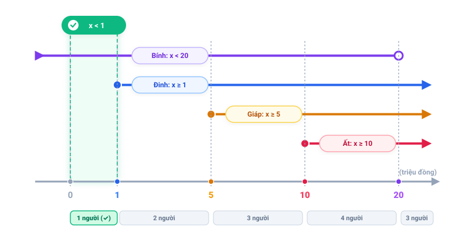

# Câu 369: Số tiền trong tài khoản của ông Trung

- **Tập:** 2
- **Phần:** Phần 7 - Phương pháp vẽ hình
- **Mức độ:** Dễ
- **Nguồn:** Sách scan - Trang 119 (Đề bài), Trang 133 (Đáp án)
- **Tóm tắt câu hỏi:** Sử dụng phương pháp vẽ trục số để tìm khoảng giá trị số tiền trong tài khoản của ông Trung khi biết chỉ có duy nhất 1 người trong 4 người đoán đúng.

---

## Đề bài

Bốn người bạn cùng đoán già đoán non về số tiền hiện có trong tài khoản ngân hàng của ông Trung:

- **Giáp nói:** "Ông Trung có ít nhất 5 triệu trong tài khoản."
- **Ất nói:** "Không đúng, ít nhất phải có 10 triệu."
- **Bính nói:** "Số tiền trong tài khoản của ông ấy không đến 20 triệu."
- **Đinh nói:** "Số tiền trong tài khoản của ông ấy ít nhất là 1 triệu."

Thực ra, trong số 4 người họ **chỉ có duy nhất một người đoán đúng**.

Từ thông tin trên, có thể suy ra khẳng định nào sau đây là đúng?

A. Giáp đoán đúng  
B. Đinh đoán đúng  
C. Số tiền trong tài khoản của ông Trung chưa đến 1 triệu  
D. Số tiền trong tài khoản của ông Trung dao động từ 5 triệu đến 20 triệu  

---

<b>💡 Xem đáp án & Lời giải chi tiết</b>

### Đáp án & Lời giải

**Chọn đáp án C: Số tiền trong tài khoản của ông Trung chưa đến 1 triệu.**

*Phân tích suy luận bằng phương pháp vẽ trục số (Vẽ hình):*
Gọi số tiền thực tế trong tài khoản của ông Trung là $x$ (đơn vị: triệu đồng).
Biểu diễn các phát biểu của 4 người dưới dạng các khoảng bất đẳng thức:
- **Giáp:** $x \ge 5$ (nửa khoảng $[5; +\infty)$)
- **Ất:** $x \ge 10$ (nửa khoảng $[10; +\infty)$)
- **Bính:** $x < 20$ (khoảng $(-\infty; 20)$)
- **Đinh:** $x \ge 1$ (nửa khoảng $[1; +\infty)$)

**Bảng đối chiếu số người đoán đúng theo từng khoảng giá trị:**

| Khoảng số tiền $x$ (triệu đồng) | Đinh ($x \ge 1$) | Giáp ($x \ge 5$) | Ất ($x \ge 10$) | Bính ($x < 20$) | Số người đoán đúng | Kết luận |
| :--- | :---: | :---: | :---: | :---: | :---: | :--- |
| **$x < 1$** | Sai | Sai | Sai | **Đúng** | **1 người** | **Thỏa mãn (Chỉ Bính đúng)** |
| **$1 \le x < 5$** | **Đúng** | Sai | Sai | **Đúng** | 2 người | Loại |
| **$5 \le x < 10$** | **Đúng** | **Đúng** | Sai | **Đúng** | 3 người | Loại |
| **$10 \le x < 20$** | **Đúng** | **Đúng** | **Đúng** | **Đúng** | 4 người | Loại |
| **$x \ge 20$** | **Đúng** | **Đúng** | **Đúng** | Sai | 3 người | Loại |

*Chi tiết từng trường hợp:*
1. **Vùng $x \ge 10$:** Cả 3 người (Đinh, Giáp, Ất) đều đúng. Nếu $10 \le x < 20$ thì cả 4 người đều đúng. $\implies$ Không thỏa mãn (vì có từ 3 đến 4 người đúng).
2. **Vùng $5 \le x < 10$:** Đinh đúng ($x \ge 1$), Giáp đúng ($x \ge 5$), Bính đúng ($x < 20$); chỉ có Ất sai. $\implies$ Có 3 người đúng $\implies$ Không thỏa mãn.
3. **Vùng $1 \le x < 5$:** Đinh đúng ($x \ge 1$) và Bính đúng ($x < 20$); Giáp và Ất sai. $\implies$ Có 2 người đúng $\implies$ Không thỏa mãn.
4. **Vùng $x < 1$ (chưa đến 1 triệu):**
   - Đinh nói $x \ge 1 \implies$ Sai.
   - Giáp nói $x \ge 5 \implies$ Sai.
   - Ất nói $x \ge 10 \implies$ Sai.
   - Bính nói $x < 20 \implies$ **ĐÚNG!**
   - Trong trường hợp này, chỉ có duy nhất một mình Bính đoán đúng, hoàn toàn khớp với dữ kiện đề bài.

Vậy số tiền trong tài khoản của ông Trung **chưa đến 1 triệu đồng**.

