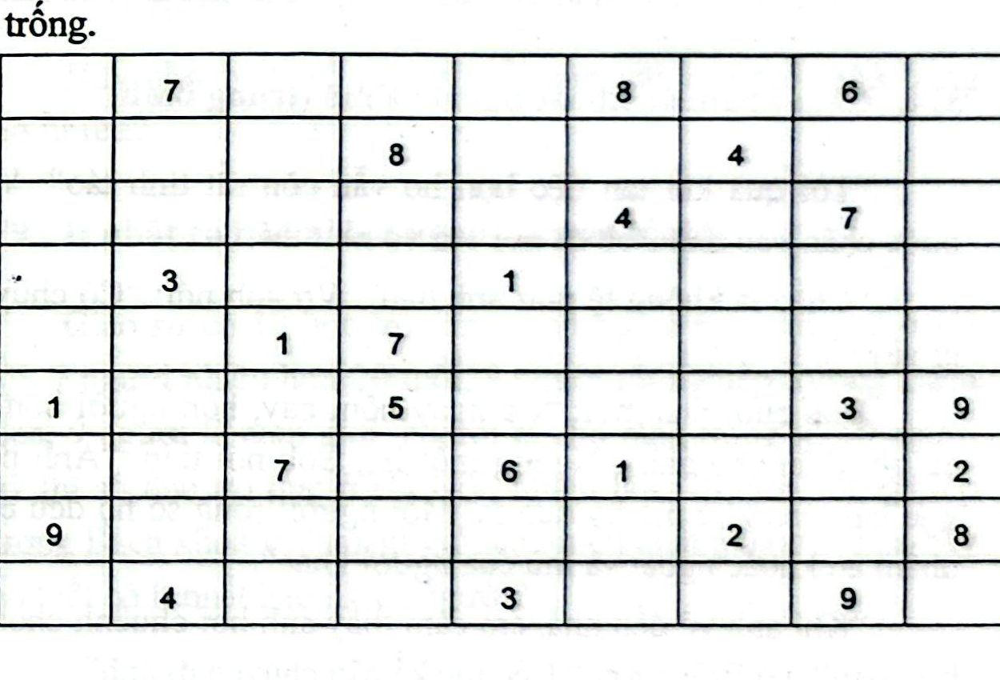
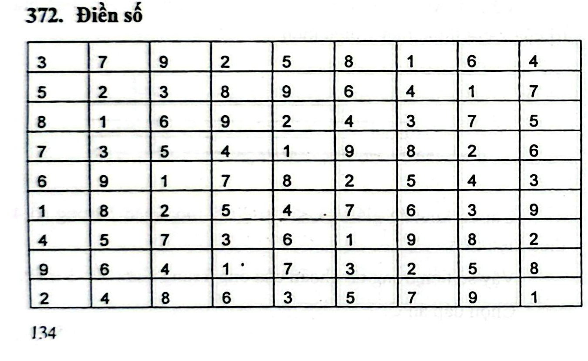

# Câu 372: Điền số

- **Tập:** 2
- **Phần:** Phần 7 - Phương pháp vẽ hình
- **Mức độ:** Trung bình
- **Nguồn:** Sách scan - Trang 121 (Đề bài), Trang 134 (Đáp án)
- **Tóm tắt câu hỏi:** Hoàn thành bảng Sudoku $9 \times 9$ có thêm ràng buộc hai đường chéo chính cũng phải chứa đầy đủ các số từ 1 đến 9 (Sudoku đường chéo / X-Sudoku).

---

## Đề bài

Dưới đây là một bảng kích thước $9 \times 9$. Hãy điền các chữ số từ 1 đến 9 vào các ô trống của bảng sao cho:
- Mỗi hàng ngang đều xuất hiện đầy đủ các chữ số từ 1 đến 9.
- Mỗi cột dọc đều xuất hiện đầy đủ các chữ số từ 1 đến 9.
- Cả hai đường chéo chính của bảng cũng đều xuất hiện đầy đủ các chữ số từ 1 đến 9.

Hiện tại bảng đã được điền sẵn một vài con số như hình vẽ dưới đây, bạn hãy điền hoàn chỉnh vào những chỗ còn trống:

---

<b>💡 Xem đáp án & Lời giải chi tiết</b>

### Đáp án & Lời giải

**Bảng số hoàn chỉnh đã điền:**

*Bảng số chi tiết theo từng hàng:*

| Hàng | C1 | C2 | C3 | C4 | C5 | C6 | C7 | C8 | C9 |
|:---:|:---:|:---:|:---:|:---:|:---:|:---:|:---:|:---:|:---:|
| **H1** | 3 | **7** | 9 | 2 | 5 | **8** | 1 | **6** | 4 |
| **H2** | 5 | 2 | 3 | **8** | 9 | 6 | **4** | 1 | 7 |
| **H3** | 8 | 1 | 6 | 9 | 2 | **4** | 3 | **7** | 5 |
| **H4** | 7 | **3** | 5 | 4 | **1** | 9 | 8 | 2 | 6 |
| **H5** | 6 | 9 | **1** | **7** | 8 | 2 | 5 | 4 | 3 |
| **H6** | **1** | 8 | 2 | **5** | 4 | 7 | 6 | **3** | **9** |
| **H7** | 4 | 5 | **7** | 3 | **6** | **1** | 9 | 8 | **2** |
| **H8** | **9** | 6 | 4 | 1 | 7 | 3 | **2** | 5 | **8** |
| **H9** | 2 | **4** | 8 | 6 | **3** | 5 | 7 | **9** | 1 |

*(Các chữ số in đậm là những số đã cho sẵn ở đề bài).*

*Kiểm tra đường chéo:*
- **Đường chéo chính (từ góc trên bên trái xuống góc dưới bên phải):**
  $\{3, 2, 6, 4, 8, 7, 9, 5, 1\}$ $\implies$ Chứa đủ các số từ 1 đến 9 không trùng lặp!
- **Đường chéo phụ (từ góc trên bên phải xuống góc dưới bên trái):**
  $\{4, 1, 3, 9, 8, 5, 7, 6, 2\}$ $\implies$ Chứa đủ các số từ 1 đến 9 không trùng lặp!

Tất cả các hàng, cột và hai đường chéo đều thỏa mãn tuyệt đối các điều kiện của bài toán.

