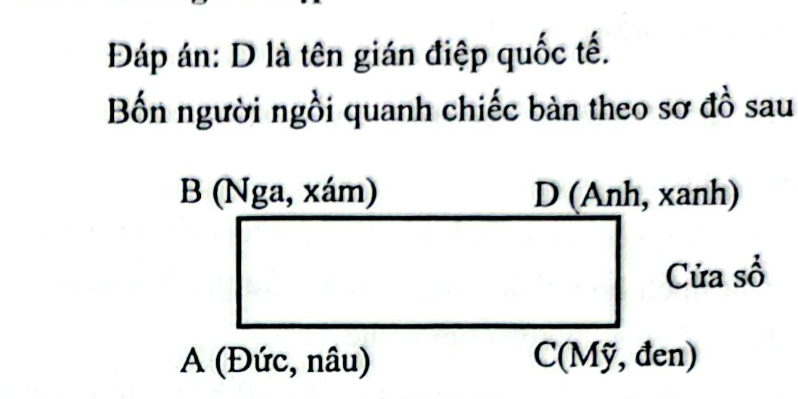

# Câu 373: Ai là gián điệp

- **Tập:** 2
- **Phần:** Phần 7 - Phương pháp vẽ hình
- **Mức độ:** Trung bình
- **Nguồn:** Sách scan - Trang 121 - 122 (Đề bài), Trang 135 (Đáp án)
- **Tóm tắt câu hỏi:** Sử dụng phương pháp vẽ sơ đồ bố trí chỗ ngồi quanh bàn để tìm ra danh tính của tên gián điệp quốc tế mặc áo khoác ngoài màu xanh.

---

## Đề bài

Trong một toa tàu trên chuyến tàu hỏa quốc tế có 4 hành khách A, B, C và D có quốc tịch khác nhau (Anh, Đức, Mỹ, Nga). Họ mặc những chiếc áo khoác có màu sắc khác nhau (xanh, nâu, đen, xám).

Họ ngồi trên hai chiếc ghế dài đối diện nhau quanh một chiếc bàn ở giữa, mỗi chiếc ghế có 2 người ngồi, trong đó có hai người ngồi cạnh cửa sổ.

Biết rằng trong số 4 người này có một người là tên gián điệp quốc tế mặc chiếc áo khoác ngoài màu xanh, đồng thời còn biết:
1. Hành khách người Anh ngồi bên trái B.
2. A mặc áo khoác ngoài màu nâu.
3. Người mặc áo màu đen ngồi bên phải hành khách người Đức.
4. Hành khách người Mỹ ngồi đối diện với D.
5. Hành khách người Nga mặc áo khoác màu xám.
6. Hành khách người Anh quay đầu về phía bên trái để nhìn ra cửa sổ.

Bạn hãy cho biết ai là tên gián điệp quốc tế mặc chiếc áo màu xanh?

---

<b>💡 Xem đáp án & Lời giải chi tiết</b>

### Đáp án & Lời giải

**Đáp án:** **D** chính là tên gián điệp quốc tế mặc chiếc áo khoác ngoài màu xanh.

*Phân tích suy luận từng bước bằng sơ đồ chỗ ngồi:*
1. **Xác định vị trí Cửa sổ và người Anh:**
   - Theo điều kiện (6): Người Anh quay đầu sang bên trái để nhìn ra cửa sổ. Nghĩa là cửa sổ nằm ở phía bên tay trái của người Anh.
   - Theo điều kiện (1): Người Anh ngồi bên trái của B. Điều này chỉ có thể xảy ra khi B và người Anh ngồi trên cùng một băng ghế, và B ngồi bên phải theo hướng của người nhìn (hoặc người Anh ngồi bên trái theo hướng của B).
   - Nhìn vào sơ đồ toa tàu: Băng ghế phía trên quay mặt nhìn xuống dưới. Đối với người ngồi băng ghế trên, hướng bên trái của họ là hướng về phía mép phải của hình vẽ (nơi có cửa sổ).
   - Do đó, **Cửa sổ nằm ở phía bên phải bàn**, và người Anh ngồi ở vị trí trên bên phải, còn B ngồi ở vị trí trên bên trái.
2. **Xác định các người còn lại:**
   - Người Anh ngồi ghế trên bên phải (sát cửa sổ). B ngồi ghế trên bên trái.
   - Theo điều kiện (4): Người Mỹ ngồi đối diện với D.
     - Ghế dưới gồm hai vị trí đối diện với B và đối diện với người ở ghế trên.
     - Vì D ngồi đối diện với người Mỹ, nên D phải ở băng ghế đối diện với người Mỹ.
     - Người Anh ở ghế trên bên phải chính là **D** (hoặc nếu D ở dưới thì đối diện là người Mỹ). Từ sơ đồ: **D chính là người Anh** ngồi ở ghế trên bên phải, và người ngồi đối diện D ở ghế dưới bên phải chính là **C (người Mỹ)**.
     - Còn lại **A** ngồi ở ghế dưới bên trái (đối diện với B).
3. **Xác định quốc tịch và màu áo:**
   - Vị trí các người:
     - **B** (ghế trên, bên trái): Theo (5), hành khách người Nga mặc áo khoác xám $\implies$ **B là người Nga, mặc áo xám**.
     - **D** (ghế trên, bên phải): Là **người Anh**, mặc **áo xanh** (vì màu áo còn lại là xanh).
     - **A** (ghế dưới, bên trái): Theo (2), A mặc **áo nâu**. Vì B là Nga, D là Anh, C là Mỹ $\implies$ **A là người Đức**.
     - **C** (ghế dưới, bên phải): Là **người Mỹ**. Theo (3), người mặc áo đen ngồi bên phải người Đức (A là Đức, nhìn lên trên thì bên phải là C) $\implies$ **C mặc áo đen**.
4. **Kết luận:**
   - Bảng tổng hợp:
     - **A:** Người Đức - Áo màu Nâu
     - **B:** Người Nga - Áo màu Xám
     - **C:** Người Mỹ - Áo màu Đen
     - **D:** Người Anh - Áo màu Xanh (Tên gián điệp quốc tế)

Vậy **D chính là tên gián điệp quốc tế**.

