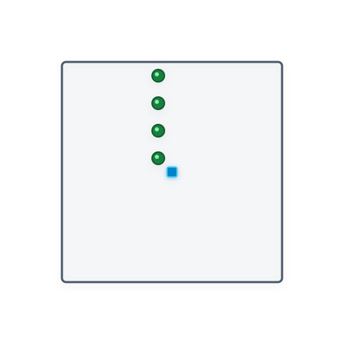
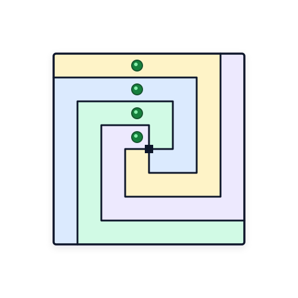

# Câu 381: Phân chia tài sản

- **Tập:** 2
- **Phần:** 7 - Phương pháp vẽ hình
- **Mức độ:** Trung bình
- **Nguồn:** Trang 126 (Đề), Trang 139 (Lời giải)
- **Tóm tắt câu hỏi:** Mảnh vườn hình vuông có 4 cây bưởi nằm thẳng hàng từ tâm ra ngoài biên. Hãy chia mảnh vườn thành 4 phần bằng nhau cả về diện tích và hình dạng, sao cho mỗi phần đất chứa đúng một cây bưởi.

---

## Đề bài

Một viên ngoại có 4 người con trai, nhưng 4 người con trai này lại có quan hệ bất hòa. Sau khi viên ngoại qua đời, 4 người con trai này phân chia tài sản. Tất cả những gì đáng tiền đều đã được phân chia hết, chỉ còn lại một mảnh vườn hình vuông khiến họ phải đau đầu mà vẫn chưa nghĩ được cách chia hợp lý. Vườn rau này như hình vẽ dưới đây:

Chỗ đánh dấu hình vuông đen nhỏ là tâm của vườn rau, trong vườn rau còn bốn cây bưởi được thể hiện bởi bốn chấm tròn nằm thẳng hàng từ tâm hướng lên cạnh trên. 

Bốn người con trai của viên ngoại đều muốn phân chia vườn rau này công bằng, tức là phần đất của mỗi người phải có diện tích và hình dạng giống nhau, hơn nữa trong phần đất của mỗi người đều có một cây bưởi.

Bạn hãy cho biết phải chia phần đất này như thế nào?

---

<b>💡 Xem đáp án & Lời giải chi tiết</b>

### Đáp án & Lời giải

Chia vườn rau thành 4 phần đất uốn lượn hình thước thợ (chữ L lồng nhau) đối xứng qua tâm quay 90° như hình vẽ sau:

*Phân tích suy luận:*
1. Mảnh vườn là một hình vuông, và bốn cây bưởi nằm thẳng hàng theo phương dọc từ tâm ra biên trên.
2. Nếu chia bằng các đường thẳng đi qua tâm chia thành 4 hình vuông nhỏ hoặc 4 hình tam giác (chia theo đường chéo), thì bốn cây bưởi sẽ nằm dồn vào một phần hoặc nằm ngay trên các đường ranh giới chia đất.
3. Để đảm bảo tính đồng dạng và bằng nhau về diện tích, phép chia phải có tính đối xứng quay tâm góc $90^\circ$.
4. Bằng cách thiết kế đường ranh giới dạng các dải uốn khúc chữ L xoắn quanh tâm:
   - Mỗi dải đất xuất phát từ khu vực tâm, uốn quanh tâm hình vuông một góc $90^\circ$ và vươn dài ra một trong bốn cạnh ngoài.
   - Bốn dải đất này hoàn toàn bằng nhau về diện tích và cùng chung một hình dạng hình học.
   - Các đường gấp khúc này phân cắt hàng cây bưởi dọc, sao cho mỗi dải đất bao trọn lấy đúng một chấm tròn (tương ứng một cây bưởi).

Cách phân chia này vừa đáp ứng tuyệt đối tiêu chuẩn công bằng về hình dáng, diện tích, vừa bảo đảm mỗi người con trai đều có đúng một cây bưởi trên phần đất của mình.

