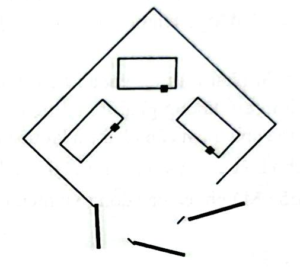
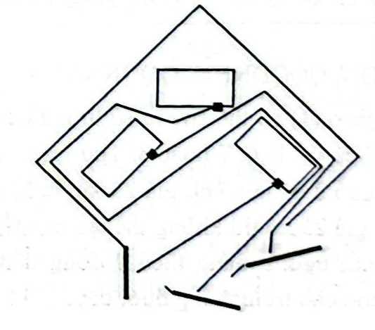

# Câu 382: Đắp đường

- **Tập:** 2
- **Phần:** 7 - Phương pháp vẽ hình
- **Mức độ:** Trung bình
- **Nguồn:** Trang 127 (Đề), Trang 139 (Lời giải)
- **Tóm tắt câu hỏi:** Ba gia đình sống trong một khuôn viên ngũ giác có ba chiếc cổng đối diện. Hãy vẽ ba con đường dẫn từ mỗi nhà ra cổng của mình sao cho các con đường không cắt nhau.

---

## Đề bài

Có ba gia đình cùng sống trong một khuôn viên hình ngũ giác như hình vẽ sau. Mỗi gia đình đều có một chiếc cổng đối diện với nhà mình:

Trước đây, ba gia đình này chung sống hòa thuận với nhau, nhưng sau này vì những chuyện nhỏ nhặt mà tranh cãi với nhau, vì thế ba gia đình này quyết định mỗi gia đình đắp một con đường từ nhà ra cổng của mình, nhưng không được cắt con đường của hai gia đình kia.

Bạn hãy cho biết họ phải đắp những con đường đó như thế nào?

---

<b>💡 Xem đáp án & Lời giải chi tiết</b>

### Đáp án & Lời giải

Ba gia đình nên đắp đường theo sơ đồ hình vẽ sau:

*Phân tích suy luận:*
1. Khuôn viên là một hình ngũ giác khép kín chứa 3 ngôi nhà hình chữ nhật (nhà trên, nhà bên trái, nhà bên phải) và 3 cổng ra vào nằm ở các cạnh đối diện:
   - **Nhà phía trên:** Cổng đối diện nằm ở góc dưới bên trái.
   - **Nhà bên phải:** Cổng đối diện nằm ở chính giữa phía đáy.
   - **Nhà bên trái:** Cổng đối diện nằm ở góc dưới bên phải.
2. Nếu cả 3 nhà đều đi thẳng qua khu vực trung tâm thì các con đường chắc chắn sẽ giao cắt nhau. Do đó, cần tận dụng các hành lang vòng men theo các ngôi nhà và bờ tường:
   - **Nhà bên phải:** Đắp đường đi thẳng từ cửa chéo xuống cổng ở chính giữa phía đáy.
   - **Nhà phía trên:** Đắp đường từ cửa đi sang trái, vòng qua mái, sườn trái và đáy của nhà bên trái, sau đó dẫn thẳng ra cổng ở góc dưới bên trái.
   - **Nhà bên trái:** Đắp đường từ cửa đi chếch lên trên sang phải, vòng qua mái và sườn phải của nhà bên phải, rồi lách theo khe tường dẫn xuống cổng ở góc dưới bên phải.
3. Với cách bố trí phân tầng thông minh này (nhà bên phải đi thẳng ở giữa; hai nhà còn lại lần lượt vòng bọc qua bên ngoài của hai nhà lân cận), cả 3 con đường độc lập hoàn toàn, không giao cắt hay đè lên nhau tại bất kỳ điểm nào, đúng chuẩn theo hình gốc của cuốn sách.

