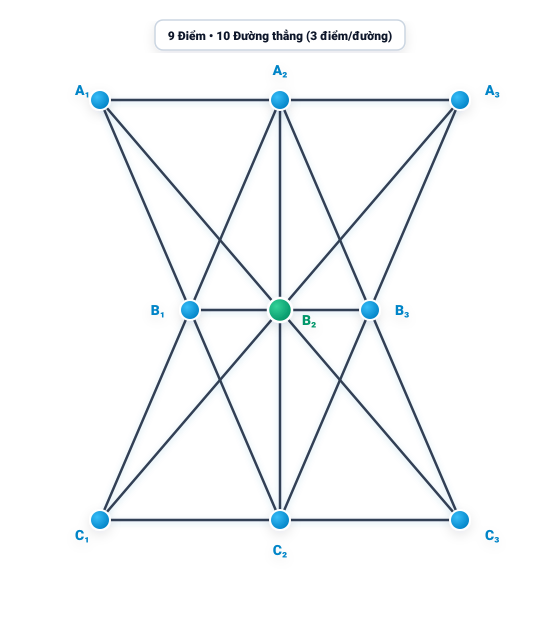

# Câu 383: Nối 9 điểm

- **Tập:** 2
- **Phần:** 7 - Phương pháp vẽ hình
- **Mức độ:** Khó
- **Nguồn:** Trang 127 (Đề), Trang 140 (Lời giải)
- **Tóm tắt câu hỏi:** Hãy xác định vị trí của 9 điểm trên mặt phẳng sao cho có thể vẽ được đúng 10 đoạn thẳng, trong đó mỗi đoạn thẳng đều đi qua 3 điểm.

---

## Đề bài

Qua 9 điểm vẽ 10 đoạn thẳng, mỗi đoạn thẳng đi qua 3 điểm. 

Hãy cho biết 9 điểm này phải có vị trí như thế nào?

---

<b>💡 Xem đáp án & Lời giải chi tiết</b>

### Đáp án & Lời giải

Vị trí của 9 điểm và 10 đoạn thẳng được bố trí như hình vẽ dưới đây:

*Phân tích suy luận:*
1. **Cấu hình hình học:**
   - 9 điểm được xếp thành 3 hàng ngang song song đối xứng:
     - Hàng ngang trên cùng gồm 3 điểm: $A_1, A_2, A_3$ (trong đó $A_2$ là trung điểm của $A_1A_3$).
     - Hàng ngang ở giữa gồm 3 điểm: $B_1, B_2, B_3$ thu hẹp dần về phía trục giữa ($B_2$ nằm chính giữa làm tâm đối xứng).
     - Hàng ngang dưới cùng gồm 3 điểm: $C_1, C_2, C_3$ đối xứng với hàng trên qua hàng giữa ($C_2$ là trung điểm của $C_1C_3$).

2. **10 đoạn thẳng thỏa mãn mỗi đoạn đi qua 3 điểm:**
   - 3 đoạn thẳng nằm ngang:
     - Đoạn thẳng 1: đi qua 3 điểm $A_1 - A_2 - A_3$.
     - Đoạn thẳng 2: đi qua 3 điểm $B_1 - B_2 - B_3$.
     - Đoạn thẳng 3: đi qua 3 điểm $C_1 - C_2 - C_3$.
   - 1 đoạn thẳng thẳng đứng:
     - Đoạn thẳng 4: đi qua 3 điểm chính giữa $A_2 - B_2 - C_2$.
   - 2 đường chéo dài cắt nhau tại tâm $B_2$:
     - Đoạn thẳng 5: đi qua 3 điểm $A_1 - B_2 - C_3$.
     - Đoạn thẳng 6: đi qua 3 điểm $A_3 - B_2 - C_1$.
   - 4 đường chéo xiên tạo hình cánh bướm:
     - Đoạn thẳng 7: đi qua 3 điểm $A_1 - B_1 - C_2$.
     - Đoạn thẳng 8: đi qua 3 điểm $A_3 - B_3 - C_2$.
     - Đoạn thẳng 9: đi qua 3 điểm $C_1 - B_1 - A_2$.
     - Đoạn thẳng 10: đi qua 3 điểm $C_3 - B_3 - A_2$.

Tổng cộng có đúng 10 đoạn thẳng, và mỗi đoạn thẳng đều đi qua chính xác 3 điểm trong số 9 điểm đã cho.

