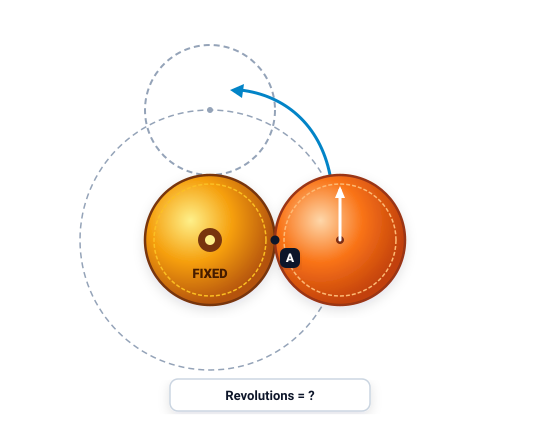
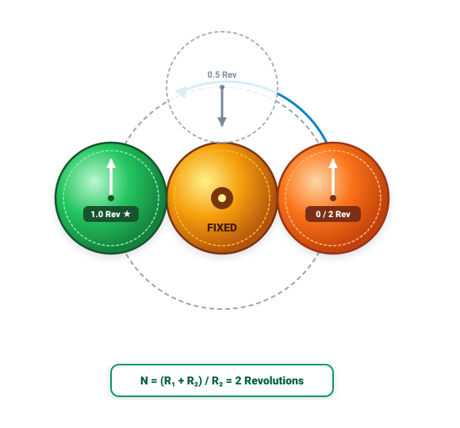

# Câu 425: Xoay đồng xu

- **Tập:** 2
- **Phần:** 8 - Phương pháp loại suy
- **Mức độ:** Trung bình
- **Nguồn:** Trang 165 (Đề), Trang 179 (Lời giải)
- **Tóm tắt câu hỏi:** Hai đồng xu giống hệt nhau đặt tiếp xúc trên mặt bàn. Giữ cố định một đồng xu, cho đồng xu thứ hai lăn không trượt vòng quanh đồng xu cố định trở về điểm xuất phát. Hỏi đồng xu thứ hai tự quay quanh trục của nó mấy vòng?

---

## Đề bài

Có hai đồng xu kích thước giống nhau được đặt trên mặt bàn. Đồng xu thứ nhất được cố định, đồng xu kia được đặt tiếp xúc với đồng xu cố định và quay quanh đồng xu cố định (xem hình vẽ):

Bắt đầu từ vị trí A, đồng xu thứ hai lăn quanh đồng xu thứ nhất. 

Bạn hãy cho biết đồng xu thứ hai muốn quay về vị trí A thì nó cần lăn mấy vòng quanh đồng xu thứ nhất? *(Nói cách khác, đồng xu thứ hai đã tự quay quanh trục của chính nó bao nhiêu vòng?)*

---

<b>💡 Xem đáp án & Lời giải chi tiết</b>

### Đáp án & Lời giải

Đáp án: **Đồng xu thứ hai tự quay được đúng 2 vòng quanh trục của nó**.

*Phân tích suy luận:*
Đây là bài toán hình học kinh điển mang tên **Nghịch lý đồng xu quay (Coin rotation paradox)**:
1. **Trực giác thông thường (dễ nhầm lẫn):**
   - Hai đồng xu có bán kính bằng nhau ($R_1 = R_2 = R$), chu vi bằng nhau ($C = 2\pi R$).
   - Nếu lăn đồng xu trên một đường thẳng có chiều dài đúng bằng chu vi $C$, đồng xu sẽ tự quay quanh trục đúng 1 vòng ($360^\circ$).
   - Do đó, nhiều người lầm tưởng rằng khi lăn quanh chu vi của đồng xu thứ nhất, nó cũng chỉ tự quay 1 vòng.

2. **Bản chất động học của chuyển động lăn tròn:**
   - Quỹ đạo của tâm đồng xu thứ hai không phải là đường thẳng mà là một **đường tròn có bán kính gấp đôi**:
     $$R_{\text{quỹ đạo}} = R_1 + R_2 = R + R = 2R$$
   - Chu vi đường tròn quỹ đạo mà tâm đồng xu thứ hai đi được là:
     $$C_{\text{tâm}} = 2\pi (2R) = 4\pi R = 2C$$
   - Chuyển động của đồng xu thứ hai bao gồm hai thành phần:
     1. Chuyển động lăn tương đối trên bề mặt đồng xu thứ nhất: đóng góp 1 vòng tự quay.
     2. Chuyển động quay của hệ quy chiếu (chuyển động của vectơ bán kính nối hai tâm quay trọn $360^\circ$ quanh tâm đồng xu cố định): đóng góp thêm 1 vòng quay nữa.
   - Do đó, tổng số vòng tự quay quanh trục của đồng xu thứ hai là:
     $$\frac{R_1 + R_2}{R_2} = \frac{R + R}{R} = \mathbf{2\text{ vòng}}.$$

*Kiểm chứng thực tế:*
Bạn có thể lấy 2 đồng xu thật thực hành ngay trên bàn: khi đồng xu thứ hai lăn được một nửa chu vi (lên vị trí đỉnh đối diện), nó đã hoàn thành trọn vẹn 1 vòng tự quay ($360^\circ$); và khi lăn tiếp nửa vòng còn lại trở về vị trí A, nó hoàn thành vòng tự quay thứ 2!

