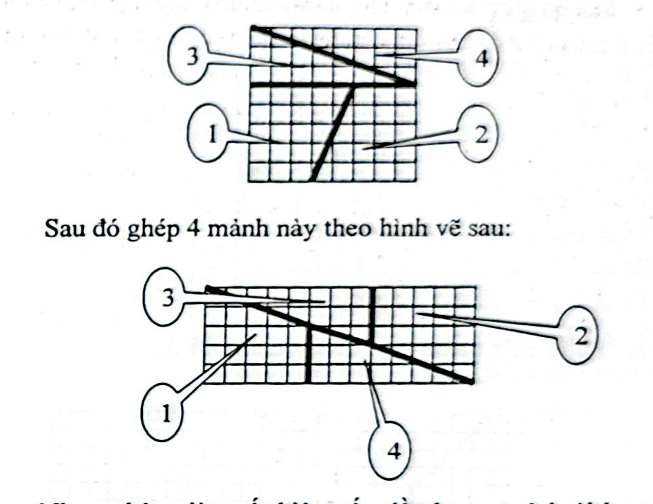

# Câu 430: Tại sao lại nhiều thêm một miếng

- **Tập:** 2
- **Phần:** 8 - Phương pháp loại suy
- **Mức độ:** Trung bình
- **Nguồn:** Trang 166 - 167 (Đề), Trang 180 (Lời giải)
- **Tóm tắt câu hỏi:** Cắt hình vuông kích thước 8x8 (64 ô) thành 4 mảnh rồi ghép lại thành hình chữ nhật 5x13 (65 ô). Hãy giải thích tại sao sau khi ghép lại diện tích lại dôi ra thêm đúng một ô vuông.

---

## Đề bài

Có một ô lưới kích thước $8 \times 8$ như hình vẽ sau. Bây giờ cắt ô lưới này thành 4 phần theo đường kẻ đậm. 

Sau đó ghép 4 mảnh này theo hình vẽ sau thành hình chữ nhật có kích thước $5 \times 13$:

Nhưng bây giờ xuất hiện vấn đề như sau: ở lưới ban đầu có $8 \times 8 = 64$ ô vuông, nhưng ở lưới thứ hai lại có $5 \times 13 = 65$ ô vuông. 

Bạn hãy cho biết tại sao sau khi ghép lại nhiều thêm một ô?

---

<b>💡 Xem đáp án & Lời giải chi tiết</b>

### Đáp án & Lời giải

Đáp án: **Đoạn ranh giới chéo của hình chữ nhật $5 \times 13$ thực chất không phải là một đường thẳng, mà có một khe hở hình bình hành cực kỳ hẹp nằm dọc theo đường nối. Diện tích của khe hở vô hình này đúng bằng 1 ô vuông**.

*Phân tích suy luận:*
Đây là nghịch lý hình học kinh điển mang tên **Nghịch lý bàn cờ của Sam Loyd** (hoặc nghịch lý phân vùng hình học dựa trên dãy số Fibonacci):
1. **Kiểm tra độ dốc (hệ số góc) của các mép cắt:**
   - 4 mảnh cắt gồm:
     - Hai hình tam giác vuông nhỏ (mảnh 3 và 4): có hai cạnh góc vuông là 3 và 8.
       $$\text{Độ dốc của cạnh huyền tam giác} = \frac{3}{8} = 0,375.$$
     - Hai hình thang vuông (mảnh 1 và 2): có các cạnh đáy là 5 và 3, chiều cao là 5. Cạnh vát xiên có độ dốc:
       $$\text{Độ dốc của cạnh vát hình thang} = \frac{5 - 3}{5} = \frac{2}{5} = 0,400.$$
     - Độ dốc của đường chéo hình chữ nhật $5 \times 13$:
       $$\text{Độ dốc đường chéo} = \frac{5}{13} \approx 0,3846.$$

2. **Bản chất của "ô vuông dôi ra":**
   - Do $\frac{3}{8} = 0,375 \neq 0,400 = \frac{2}{5}$, nên khi đặt 4 mảnh ghép lại với nhau, các cạnh huyền của tam giác và cạnh vát của hình thang **không nằm trên cùng một đường thẳng**.
   - Chúng hơi lệch nhau và tạo ra một khoảng trống hình bình hành rất mỏng kéo dài từ góc này sang góc kia của hình chữ nhật.
   - Diện tích của khe hở hình bình hành này chính là:
     $$S_{\text{khe hở}} = (5 \times 13) - (8 \times 8) = 65 - 64 = 1\text{ ô vuông}.$$
   - Do mắt người nhìn tổng thể dễ bỏ qua độ chênh lệch rất nhỏ giữa góc nghiêng $0,375$ và $0,400$, ta ngỡ rằng các mảnh ghép khớp khít hoàn toàn và lầm tưởng rằng có thêm một ô vuông xuất hiện kỳ diệu!

*(Về mặt toán học, điều này bắt nguồn từ hệ thức Cassini nổi tiếng của dãy Fibonacci: $F_{n-1}F_{n+1} - F_n^2 = (-1)^n$. Với ba số Fibonacci liên tiếp $5, 8, 13$, ta có: $5 \times 13 - 8^2 = 65 - 64 = 1$).*

