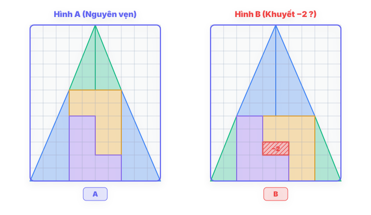
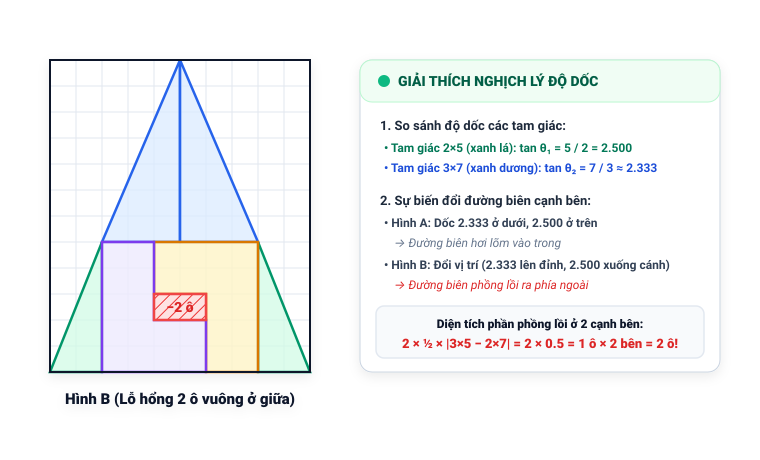

# Câu 431: Tại sao lại thiếu 2 ô

- **Tập:** 2
- **Phần:** Phần 8: Phương pháp loại suy
- **Mức độ:** Trung bình
- **Nguồn:** Trang 167 - 168 (Tập 2)
- **Tóm tắt câu hỏi:** Một lưới hình tam giác cân $10 \times 12$ ô được cắt thành 8 mảnh nhỏ. Khi ghép lại thành một hình tam giác tương tự thì ở giữa xuất hiện một lỗ hổng thiếu 2 ô. Giải thích tại sao lại có sự biến mất kỳ lạ này.

---

## Đề bài

Một lưới có $10 \times 12$ ô như hình vẽ (A), người ta cắt thành 8 mảnh nhỏ theo các đường kẻ đậm. Sau đó ghép lại thành hình vẽ (B), bạn sẽ nhận thấy ở giữa xuất hiện một ô trống thiếu 2 ô:

Bạn có biết tại sao không?

---

<b>💡 Xem đáp án & Lời giải chi tiết</b>

### Đáp án & Lời giải:

Cũng giống như bài toán 430, vấn đề này là do độ dốc của các cạnh tam giác ghép không bằng nhau, các cạnh của tam giác không tạo nên đường thẳng hoàn hảo.
 

 
*Phân tích suy luận:*
1. **Xét độ dốc của các mảnh ghép:**
   - Trong hình ban đầu, tam giác lớn có đáy 10 ô và chiều cao 12 ô.
   - Các mảnh cắt được chia ra gồm các hình thang và hình tam giác vuông nhỏ.
   - Độ dốc (tang của góc nghiêng so với phương thẳng đứng hoặc nằm ngang) của cạnh huyền các mảnh cắt không hoàn toàn đồng nhất với nhau.
2. **Ảo ảnh hình học:**
   - Khi ghép các mảnh lại ở hình thứ hai, các cạnh bên trông có vẻ là một đường thẳng thẳng tắp nhưng thực chất lại bị uốn cong lồi nhẹ ra phía ngoài.
   - Diện tích của phần phồng nhẹ ra phía ngoài dọc theo hai cạnh bên của tam giác ghép chính bằng diện tích của 2 ô vuông trống xuất hiện ở chính giữa ($S = 2\text{ ô}$).
   - Do đó, tổng diện tích thực của 8 mảnh ghép không hề thay đổi, sự xuất hiện của lỗ hổng 2 ô chỉ là do sự sai lệch rất tinh vi ở đường biên ngoài của hình tam giác ghép.

