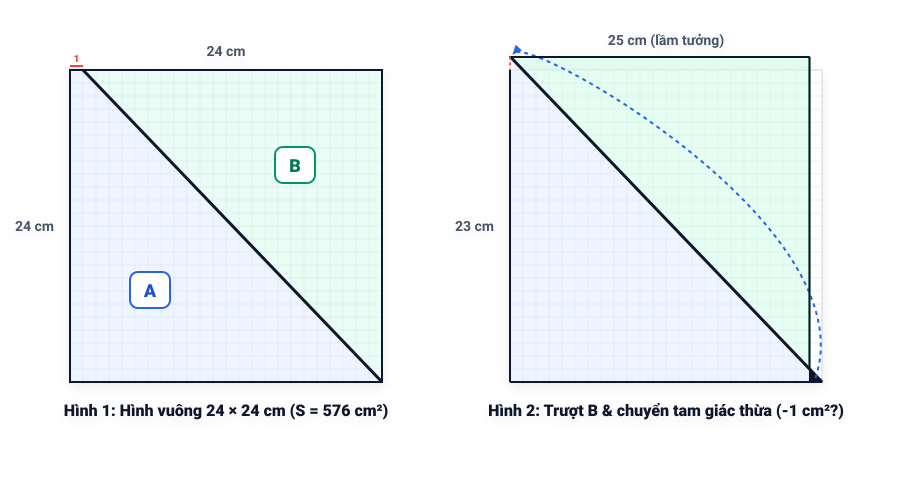
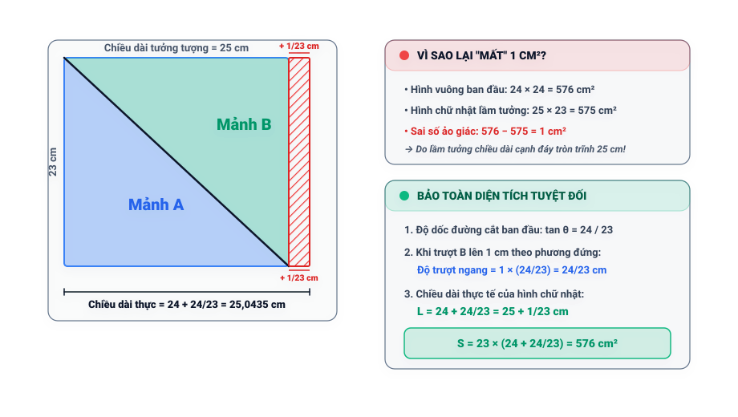

# Câu 432: Thiếu một centimet vuông

- **Tập:** 2
- **Phần:** Phần 8: Phương pháp loại suy
- **Mức độ:** Trung bình
- **Nguồn:** Trang 168 - 169 (Tập 2)
- **Tóm tắt câu hỏi:** Cắt hình vuông $24 \times 24\text{ cm}$ thành 2 phần A và B, trượt phần B lên 1 ô và chuyển mảnh tam giác thừa để ghép thành hình chữ nhật $25 \times 23\text{ cm}$. Tại sao diện tích tính toán lại bị giảm mất $1\text{ cm}^2$?

---

## Đề bài

Một hình vuông có chiều dài mỗi cạnh là 24 cm, diện tích của nó là $24 \times 24 = 576\text{ cm}^2$, sau đó chia mỗi cạnh thành 24 phần bằng nhau, mỗi đoạn dài 1 cm. Cắt theo đường chéo để chia thành 2 phần A và B (Hình 1).

Sau đó trượt phần B theo đường cắt lên phía trên 1 ô (Hình 2). Cắt tam giác thừa (tô màu đen ở góc dưới bên phải), ghép lên phần bị thiếu ở góc trên bên trái:

Bây giờ, chúng ta nhận được một hình chữ nhật, có chiều dài danh nghĩa là 25 cm, chiều rộng 23 cm, diện tích tính theo các số nguyên này là $25 \times 23 = 575\text{ cm}^2$. So với hình vuông ban đầu, diện tích dường như nhỏ hơn $1\text{ cm}^2$.

Bạn hãy cho biết tại sao lại thiếu mất $1\text{ cm}^2$?

---

<b>💡 Xem đáp án & Lời giải chi tiết</b>

### Đáp án & Lời giải:

Thực ra chiều dài của hình chữ nhật không phải là 25 cm mà là $24 + \frac{24}{23}\text{ cm}$. Vì thế diện tích của hình chữ nhật là:
$$23 \times \left(24 + \frac{24}{23}\right) = 23 \times 24 + 24 = 576\text{ cm}^2\text{ (không thay đổi)}$$

*Phân tích suy luận:*
1. Đường cắt chéo ban đầu nối từ điểm cách đỉnh trên bên trái 1 ô xuống góc dưới bên phải (hoặc theo tỷ lệ đường chéo nghiêng). Khi trượt phần B lên 1 ô theo phương đứng, tam giác nhỏ được cắt ra và bù vào góc đối diện.
2. Tuy nhiên, tỉ lệ các cạnh tam giác đồng dạng cho thấy độ dịch chuyển ngang tương ứng khi dịch chuyển 1 ô theo phương đứng không làm tăng chính xác 1 cm chiều dài toàn phần, mà cạnh dài mới thực chất là $24 + \frac{24}{23}\text{ cm} \approx 25{,}0435\text{ cm}$.
3. Khi giả định chiều dài chỉ là 25 cm tròn trĩnh, ta đã vô tình bỏ qua phần diện tích dải mỏng siêu nhỏ có tổng diện tích bằng:
   $$23 \times \left(24 + \frac{24}{23} - 25\right) = 23 \times \frac{1}{23} = 1\text{ cm}^2$$
4. Do đó, $1\text{ cm}^2$ "bị thiếu" chỉ là kết quả của việc làm tròn sai kích thước chiều dài hình chữ nhật. Diện tích vật lý thực tế được bảo toàn tuyệt đối là $576\text{ cm}^2$.

