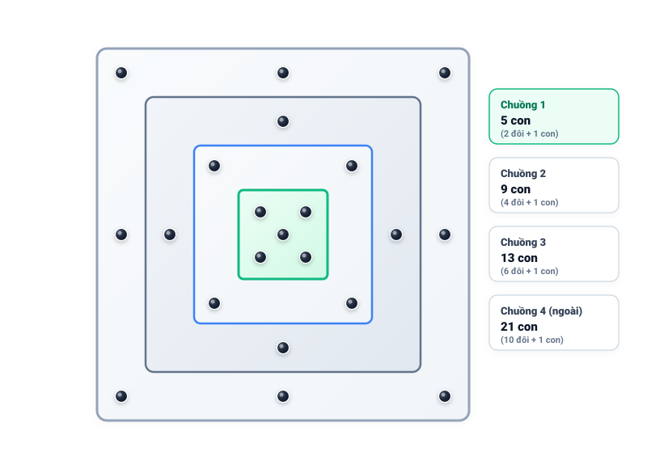

# Câu 443: Chuồng lợn của người Ireland

- **Tập**: 2
- **Phần**: Phần 9 - Phương pháp tổng hợp
- **Mức độ**: Khó
- **Nguồn**: Trang 188 – 189 (Đề bài), Trang 213 (Lời giải)
- **Tóm tắt câu hỏi**: Có 21 con lợn nhốt vào một chuồng hình chữ nhật. Cần dùng các tấm phên chia thành 4 chiếc chuồng sao cho trong mỗi chiếc chuồng đều chứa một số chẵn đôi lợn cộng thêm một con (tức số lẻ con lợn dạng $2k + 1$). Làm thế nào để giải bài toán nghịch lý này khi tổng 4 số lẻ luôn là số chẵn?

---

### Đề bài

Khi còn du học ở nước ngoài, có một lần tôi đạp xe đạp ra vùng ngoại ô thành phố, thì gặp một người Ireland cởi mở thân thiện. Vườn hoa quả và giếng nước khơi trong trẻo của ông khiến cho căn nhà nhỏ của ông trở thành thánh địa của những người đạp xe đi chơi như tôi. Người chủ nhà này có một điểm rất đặc biệt, khi kể chuyện cười, ông ta không bao giờ cười.

Tôi nói với ông ta, tôi với ông ta rất giống nhau, bởi vì cùng sống nhờ vào “pen” (pen trong tiếng Anh có nghĩa là bút, cũng có nghĩa là chuồng lợn). Lúc đó, ông đố tôi một bài toán: 

“Có 21 con lợn. Bây giờ nhốt chúng trong một chiếc chuồng hình chữ nhật. Đồng thời dùng những tấm phên để ngăn chiếc chuồng ấy thành 4 chiếc chuồng sao cho trong mỗi chuồng đều có một số chẵn đôi lợn cộng thêm một con”.

Bạn hãy giúp tôi giải bài toán này.

---

💡 Xem đáp án & Lời giải chi tiết

### Đáp án

Thiết kế 4 chuồng lợn theo dạng **các hình vuông lồng nhau** (chuồng lớn bao trọn lấy chuồng nhỏ bên trong).

### Lời giải chi tiết

Về mặt số học thuần túy, nếu 4 chuồng tách rời nhau hoàn toàn thì tổng số lợn trong 4 chuồng phải là tổng của 4 số lẻ, mà tổng 4 số lẻ luôn là một số chẵn, không thể bằng 21 (là số lẻ).

Mấu chốt để giải quyết bài toán là: **dùng các tấm phên ngăn thành các chuồng lồng nhau (chuồng nọ bao lấy chuồng kia)**. Khi một chuồng nằm lọt bên trong một chuồng lớn hơn, các con lợn ở chuồng nhỏ bên trong cũng đồng thời được tính là thuộc về chuồng lớn bên ngoài.

**Bảng phân bổ chi tiết 21 con lợn vào 4 chuồng:**

| Chiếc chuồng | Vị trí hình học | Số con lợn nhốt thêm ở vành | Tổng số lợn nằm trong chuồng | Quy đổi số chẵn đôi + 1 con |
| :---: | :--- | :---: | :---: | :---: |
| **Chuồng 1** | Trong cùng (hình vuông nhỏ) | 5 con (tại tâm và 4 góc) | **5 con** | $2 \text{ đôi} + 1\text{ con}$ ($2 \times 2 + 1$) |
| **Chuồng 2** | Vành giữa Chuồng 1 và 2 | 4 con (ở 4 góc của vành) | $5 + 4 = \mathbf{9\text{ con}}$ | $4 \text{ đôi} + 1\text{ con}$ ($4 \times 2 + 1$) |
| **Chuồng 3** | Vành giữa Chuồng 2 và 3 | 4 con (ở 4 trung điểm cạnh) | $9 + 4 = \mathbf{13\text{ con}}$ | $6 \text{ đôi} + 1\text{ con}$ ($6 \times 2 + 1$) |
| **Chuồng 4** | Ngoài cùng (vành giữa 3 và 4) | 8 con (4 góc + 4 cạnh) | $13 + 8 = \mathbf{21\text{ con}}$ | $10 \text{ đôi} + 1\text{ con}$ ($10 \times 2 + 1$) |
| **Tổng thực tế** | **Toàn bộ khuôn viên** | **$5 + 4 + 4 + 8 = 21$ con** | — | **Thỏa mãn tất cả 4 chuồng** |

Cả 4 chiếc chuồng đều thỏa mãn điều kiện chứa một số chẵn đôi lợn cộng thêm một con, và tổng số lợn thực tế đúng bằng 21 con!

