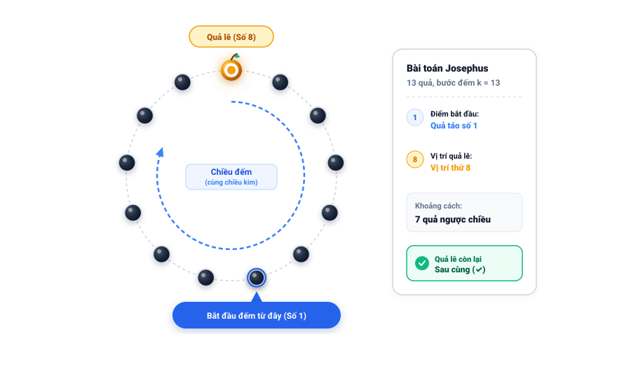

# Câu 447: Ăn trái cây

- **Tập**: 2
- **Phần**: Phần 9 - Phương pháp tổng hợp
- **Mức độ**: Khó
- **Nguồn**: Trang 190 (Đề bài), Trang 216 – 217 (Lời giải)
- **Tóm tắt câu hỏi**: 12 quả táo và 1 quả lê xếp thành vòng tròn 13 quả. Minh phải đếm theo một chiều cố định, cứ đếm đến 13 thì ăn quả đó rồi tiếp tục đếm đến 13 cho đến khi quả cuối cùng còn lại là quả lê. Minh cần chọn điểm bắt đầu đếm ở vị trí nào so với quả lê?

---

### Đề bài

Mẹ mua một làn trái cây, gồm 12 quả táo và 1 quả lê. Sau đó, mẹ xếp 13 trái cây thành hình một vòng tròn, rồi nói với Minh: “Con có thể ăn những trái cây này, nhưng có một điều kiện: con phải đếm theo cùng một chiều (cùng chiều hoặc ngược chiều kim đồng hồ), mỗi lần đếm đến 13 thì ăn trái cây ở vị trí đó. Sau đó tiếp tục đếm, đếm đến 13 lại ăn trái cây ở vị trí đó. Cứ làm như thế cho đến khi trái cây cuối cùng còn lại là quả lê. Con có làm được không?”. 

Nếu bạn là Minh, bạn sẽ đếm như thế nào?

---

💡 Xem đáp án & Lời giải chi tiết

### Đáp án

Minh cần bắt đầu đếm tại quả táo nằm ở **vị trí thứ 7 tính từ quả lê ngược chiều đếm** (tức quả lê nằm ở **vị trí thứ 8** nếu bắt đầu đếm từ quả đầu tiên theo chiều kim đồng hồ).

### Lời giải chi tiết

Đây là bài toán loại trừ vòng tròn kinh điển (**Bài toán Josephus**) với số lượng phần tử $n = 13$ và bước đếm $k = 13$.

Có hai phương pháp để tìm ra vị trí bắt đầu chính xác:

#### Phương pháp 1: Mô phỏng nháp (hoặc diễn tập trước)
1. Vẽ một vòng tròn gồm 13 vị trí đánh số từ 1 đến 13 theo chiều kim đồng hồ.
2. Chọn vị trí số 1 làm vị trí bắt đầu đếm.
3. Đếm từ 1 đến 13: quả thứ 13 bị loại (ăn).
4. Tiếp tục từ vị trí tiếp theo, đếm 13 bước trên các vị trí còn lại và gạch bỏ quả thứ 13 đó.
5. Lặp lại quá trình cho đến khi chỉ còn đúng 1 vị trí cuối cùng không bị gạch bỏ.
6. Khi đã biết vị trí sống sót cuối cùng này (kết quả là vị trí số 8), Minh chỉ việc **đặt quả lê vào đúng vị trí số 8**, và vị trí số 1 chính là điểm Minh bắt đầu đếm!
   - Ngược lại, nếu vị trí quả lê đã cố định trước, Minh chỉ cần đếm ngược lại 7 vị trí (ngược chiều đếm) để chọn vị trí bắt đầu đếm.

#### Phương pháp 2: Công thức truy hồi toán học (Josephus Problem)
Hàm vị trí phần tử sống sót sau cùng $J(n, k)$ với chỉ số đánh số từ 0 (0-indexed):
$$J(1, k) = 0$$
$$J(n, k) = (J(n - 1, k) + k) \bmod n$$

**Bảng tính toán truy hồi từng bước với $k = 13$:**

| Số phần tử $n$ | Công thức truy hồi: $(J(n-1, 13) + 13) \bmod n$ | Vị trí sống sót (0-indexed) | Vị trí thực tế (1-indexed) |
| :---: | :--- | :---: | :---: |
| **1** | Cơ sở: $J(1, 13) = 0$ | 0 | 1 |
| **2** | $(0 + 13) \bmod 2 = 13 \bmod 2$ | 1 | 2 |
| **3** | $(1 + 13) \bmod 3 = 14 \bmod 3$ | 2 | 3 |
| **4** | $(2 + 13) \bmod 4 = 15 \bmod 4$ | 3 | 4 |
| **5** | $(3 + 13) \bmod 5 = 16 \bmod 5$ | 1 | 2 |
| **6** | $(1 + 13) \bmod 6 = 14 \bmod 6$ | 2 | 3 |
| **7** | $(2 + 13) \bmod 7 = 15 \bmod 7$ | 1 | 2 |
| **8** | $(1 + 13) \bmod 8 = 14 \bmod 8$ | 6 | 7 |
| **9** | $(6 + 13) \bmod 9 = 19 \bmod 9$ | 1 | 2 |
| **10** | $(1 + 13) \bmod 10 = 14 \bmod 10$ | 4 | 5 |
| **11** | $(4 + 13) \bmod 11 = 17 \bmod 11$ | 6 | 7 |
| **12** | $(6 + 13) \bmod 12 = 19 \bmod 12$ | 7 | 8 |
| **13** | $(7 + 13) \bmod 13 = 20 \bmod 13$ | **7** | **8 (Quả lê)** |

Chỉ số 0-indexed là 7, tương ứng với **vị trí thứ 8** (nếu đếm từ 1). 
Như vậy, nếu đếm bắt đầu từ vị trí 1, thì quả lê ở vị trí 8 sẽ là quả được giữ lại sau cùng.

