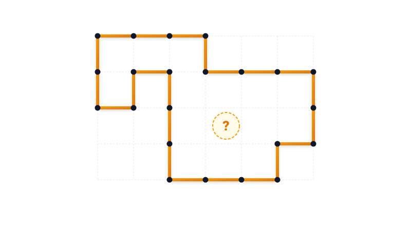
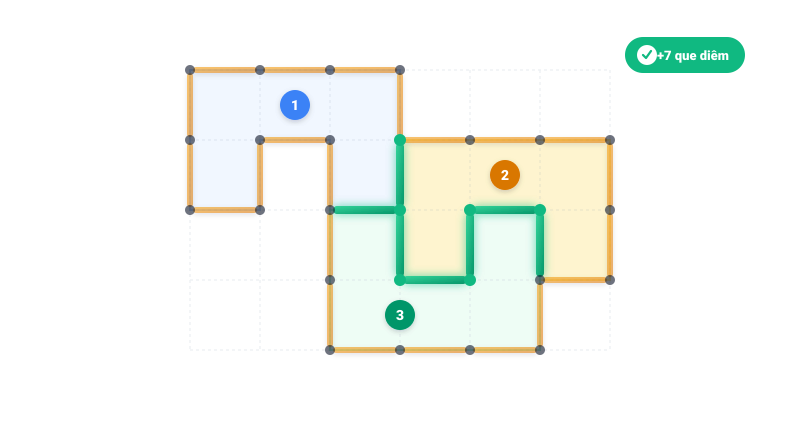

# Câu đố 452: Chia thành những phần bằng nhau (khó)

- **Tập:** 2
- **Phần:** 9 - Phương pháp tổng hợp
- **Mức độ:** Khó
- **Nguồn:** Trang 193 (Đề bài), Trang 220 (Đáp án)
- **Tóm tắt câu hỏi:** Cho một hình đa giác bao quanh bởi các đoạn que diêm trên lưới ô vuông. Cần dùng thêm ít nhất bao nhiêu que diêm để chia hình này thành 3 phần có diện tích và hình dạng giống hệt nhau?

---

### Đề bài

Hình vẽ dưới đây được ghép bởi các que diêm tạo thành một đường bao kín trên lưới ô vuông (với mỗi đoạn giữa hai điểm mút là chiều dài 1 que diêm). Bạn hãy dùng thêm các que diêm để chia hình này thành 3 phần có diện tích và hình dạng giống hệt nhau.

Bạn cần dùng thêm ít nhất bao nhiêu que diêm để làm việc đó?

---

💡 Xem đáp án & Lời giải chi tiết

### Đáp án

Cần dùng thêm **7 que diêm**.

### Lời giải chi tiết

1. **Phân tích hình học ban đầu:**
   - Đa giác bao ngoài gồm 22 đoạn que diêm đơn vị khép kín, bao trọn một vùng diện tích gồm đúng **15 ô vuông đơn vị**.
   - Vì yêu cầu chia thành 3 phần có diện tích và hình dạng giống hệt nhau (đồng dạng và cùng kích thước), nên mỗi phần bắt buộc phải có diện tích là:
     $$\frac{15}{3} = \mathbf{5\text{ ô vuông đơn vị (Pentomino)}}$$

2. **Cách bố trí 7 que diêm ngăn cách:**
   - Để chia 15 ô vuông thành 3 mảnh pentomino bằng nhau, ta đặt thêm **7 que diêm** vào bên trong (các đường nét màu xanh ngọc trên hình vẽ).
   - Khi đó, hình ban đầu được phân chia hoàn hảo thành 3 mảnh hình chữ U (U-pentomino) đồng dạng:
     - **Mảnh 1 (Phía trên - bên trái):** Gồm 5 ô vuông xếp thành hình chữ U ngửa.
     - **Mảnh 2 (Phía trên - bên phải):** Gồm 5 ô vuông xếp thành hình chữ U ngửa.
     - **Mảnh 3 (Phía dưới - ở giữa):** Gồm 5 ô vuông xếp thành hình chữ U úp (xoay $180^\circ$ so với mảnh 1 và 2).

**Bảng chi tiết thông số 3 mảnh ghép:**

| Mảnh ghép | Vị trí | Số ô vuông (Diện tích) | Hình dạng hình học | Số que diêm ngăn cách bên trong |
| :---: | :--- | :---: | :---: | :---: |
| **Mảnh 1** | Phía trên bên trái (màu lam) | 5 ô | Chữ U (U-pentomino) | 2 que diêm giáp Mảnh 3 |
| **Mảnh 2** | Phía trên bên phải (màu vàng) | 5 ô | Chữ U (U-pentomino) | 3 que diêm giáp Mảnh 3 |
| **Mảnh 3** | Phía dưới ở giữa (màu xanh) | 5 ô | Chữ U xoay $180^\circ$ | 2 que giáp Mảnh 1 + 3 que giáp Mảnh 2 + 2 que zíc-zắc |
| **Tổng cộng** | **3 mảnh giống hệt nhau** | **15 ô** | **Đồng dạng $100\%$** | **Đúng 7 que diêm** |

Cả 3 phần đều có diện tích đúng bằng 5 ô vuông và cùng mang hình dạng chữ U, có thể đặt khít vừa vặn lên nhau thông qua phép quay đối xứng.

